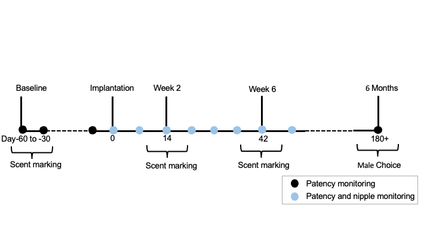

```{r setup and color, include=FALSE}
knitr::opts_chunk$set(echo = TRUE)
#setwd("/Users/afreeman/Desktop")
getwd()

#load all libraries
library(ade4)
library(ade4TkGUI)
library(ggplot2)
library(ggthemes)
library(lme4)
library(lmerTest)
library(emmeans)
library(car)
library(cowplot)
library(dbplyr)
library(dplyr)
library(broom)
library("ggpubr")


## Function for standard error
serr <- function(x) sqrt(var(x,na.rm=TRUE)/length(na.omit(x)))

##Theme for plots
theme_alex <- function(base_size=12, base_family ="Arial") {
  theme_few() %+replace%
    theme(axis.ticks = element_blank(), legend.title=element_text(size=12, face="bold"), 
          axis.title=element_text(size=12,face="bold"),
          axis.line = element_line(colour = "black"),
          panel.border = element_blank(),
          legend.position = "right")
  
}

COLOR1 <- "#B31B1B" #cornell red "#D98DE9"
COLOR2 <- "#222222" #cornell grey "#E9D98D"
```

# Introduction

For successful reproduction, animals must be fertile, receptive, and find an appropriate mate during that time. To combat the barriers to successful reproduction, animals often advertise their fertility and receptivity through signals. These can include odors [@ferkinOdorCommunicationMate2018; @johnstonChemicalCommunicationRodents2003], vocalizations [@ronaldMaleMiceAdjust2020], and behaviors [@zipsePacedMatingBehavior2000]. For nocturnal rodents, odors that persist in the environment (e.g., scent marks) are a particularly salient method of advertising presence, identity, and reproductive status [@ferkinOdorCommunicationMate2018; @ferkinOdorPreferenceSocial2011; @drickamerOestrousFemaleHouse1992; @carrResponsesMaleRats1980; @freemanAnogenitalDistancePredicts2019]. 

A critical mediator of reproductive status and maturity is the hypothalamic-pituitary-gonadal (HPG) axis and its associated hormones, which are responsible for both the onset of puberty [@hanActivationGonadotropinReleasingHormone2005; @uenoyamaCentralMechanismControlling2019], and the reproductive cycling common in mammals [@christianNeurobiologyPreovulatoryEstradiolInduced2010]. Accordingly, changes in this axis can result in altered reproductive maturation, fertility, and cycling [@rivierInfluenceCorticotropinreleasingFactor1984; @peragineRFamiderelatedPeptide3RFRP32017; @bottcherImpactOpioidSystem2017; @grossetContraceptiveEffectPotential2012]. One milestone of reproductive maturation for female rodents is vaginal introitus or patency, whereby the vagina develops an external opening [@whitsettPhotoperiodReproductionFemale1982; @millerLongerLifeSpans2002]. This development usually coincides with weaning from the female's dam and the onset of first estrus [@whitsettPhotoperiodReproductionFemale1982]. However, in the African giant pouched rat (_Cricetomys ansorgei_) patency onset can be delayed well into adulthood, and once patent, females can revert as adults to a non-patent state [@freemanAnogenitalDistancePredicts2019]. Because females who are nonpatent cannot mate, males would have a reproductive advantage if they are able to detect patency though cues or signals. Indeed, males can discriminate between patent and nonpatent females based on odor alone [@freemanAnogenitalDistancePredicts2019]. Similarly, patent females also have a discrimination advantage and discriminate between 'competitive' and 'non-competitive' males, though nonpatent females do not [@freemanAnogenitalDistancePredicts2019].

In other rodents, the development of patency coincides with the increase in gonadal steroids at the time of puberty and weaning [@whitsettPhotoperiodReproductionFemale1982]. In some species, females can become nonpatent in the winter or non-breeding season when sex steroid concentrations are low. For both deer mice (_Peromyscus maniculatus_) and Siberian hamsters (_Phodopus sungorous_), patency is dependent on photoperiod, indicating patency changes with breeding seasons and the associated changes in sex steroids [@whitsettPhotoperiodReproductionFemale1982; @placeShortDayLengths2004]. Notably, treatment with estradiol in short daylengths can induce the uterine horns to increase in mass, and for female Siberian hamsters to become patent [@placeShortDayLengths2004].

Deslorelin, a long-acting gonadotropin releasing hormone (GnRH) agonist, is used in many species as a form of contraception to induce a pseudo-menopausal state [@grossetContraceptiveEffectPotential2012; @munsonEfficacyGnRHAnalogue2001; @vanzeelandUseGnRHAgonist2014]. A GnRH agonist binds receptors located in the anterior pituitary and initially induces an increase in luteinizing hormone (LH) and follicle stimulating hormone (FSH) release. LH and FSH secretion then stimulate the gonads to release sex steroid hormones (progesterone and estrogens for females). However, with prolonged activity, the GnRH agonist will desensitize the anterior pituitary and induce negative feedback that eventually reduces sex steriod production in the ovaries [@grossetContraceptiveEffectPotential2012]. Previous studies in female cats (i.e., queens) have shown that deslorelin implantation significantly reduced the levels of estradiol in the blood (Munson, 2001). 

Given the role that sex steroids and the HPG axis play in patency in other rodents, we predicted that a GnRH agonist implant (i.e., Deslorelin) would reduce estradiol over the long term and induce nonpatency in pouched rats. We further predicted that this change in GnRH would impact female advertisement and receptivity behavior. To test these predictions we implanted females with Deslorelin or a vehicle implant (Saline). We monitored patency over 6 months in these females, and conducted two behavioral assays. First, we examined how females might scent mark in response to male urine. Secondly, we assayed female approach and aggression towards a male, and that male's response to those females in a 3-chamber social interaction test.

# Methods

## Animals
 The animals used in this study included animals captured at our field site in Morogoro, Tanzania as adults, and their descendants that were born in our captive colony.

We used 16 females for Deslorelin (or saline) implantation and scent marking behavior testing. We conducted baseline scent marking experiments (prior to Deslorlelin or Saline implantation, see below) on 13 of these patent females. Nine females were wild-caught adults of unknown age, and the other 7 females were born in captivity as descendants from wild-caught pouched rats. Captive-born animals were weaned from their mothers after 2 months and were housed with same-sex siblings (when available) in the colony room for up to 2 additional months. Young pouched rats were then housed individually in single-sex colony rooms, identical to the rest of the adults in the colony. All the animals were housed singly in standard rabbit cages (61 x 61 x 41 cm; Hoeltge Inc., Cincinnati, OH, U.S.A.), with males and females in separate rooms. Newspaper was used as bedding in each cage. The colony followed a 12:12 h light:dark cycle (lights off at 1400 hours Eastern Daylight Time, EDT) and was maintained at 21°C and 45% humidity. The animals were fed Teklad F6 rodent diet (Envigo, Huntingdon, U.K.), provided water ad libitum, and given weekly treats of fruits, vegetables, or seeds. All of the work detailed here was approved by the U.S. Army Medical Research and Materiel Command (USAMRMC) Animal Care and Use Review Office (ACURO) and the Cornell Institutional Animal Care and Use Committee (IACUC).
 
## Implantation
16 adult females were briefly anesthetized using isoflurane gas and then implanted with either a Deslorelin implant (n = 8, Virbac Ltd, Westlake, TX) or vehicle implant (n = 8, Virbac Ltd, Westlake, TX) placed subcutaneously on the dorsal side of the animal just caudal to the shoulder blades and near the midline as recommended by the manufacturer. All females were patent at the start of the experiment, except one that had reverted to non-patency one week prior to implantation. Animals were separated into two groups of 8 (4 Deslorelin and 4 Control in each group) and the second group received implants 7 weeks after the first due to practical considerations. All implants were placed on a Monday, and this was defined as 'day 0' (Figure 1) for each group.


```{r design, echo=FALSE, out.width = "400px", fig.cap="Timeline of methods."}

```


## Physical examination

We closely monitored vaginal patency of the female African giant pouched rats on a weekly basis with visual inspection assisted by a periodontal probe when the female was under isofluorane anesthesia. We scored the measurements as either nonpatent (i.e., fused, with no opening in the skin), patent (i.e., unfused, with opening in the skin), or patent closed (i.e., unfused, with partial opening in the skin). While females were anesthetized, we weighed the rats and recorded nipple size. Nipple size was measured using a wire gauge measuring tool that included numerical measurements with decreasing diameter indicated by larger numbers. 

## Urine Collection
Adult male urine was collected prior to the start of female experiments for use in scent marking behavior experiments. Urine was collected by placing aluminum trays underneath individual male cages. Urine was aliquoted using a clean pipette into 1mL samples within 2 h of deposition in the tray. The samples were frozen immediately at -20°C. To eliminate potential female preferences for specific males, we thawed then mixed urine from 13 males for the first group of females, and 10 males for the second group of females to create a homogenous stock for scent marking trials. These mixtures were frozen in aliquots until use on the day of the trial.

## Behavior

### Scent marking

Scent marking testing was conducted prior to implantation (n = 13 females), and during weeks 2 and 6 (n = 16 females) of the experiment in the behavior testing room. All scent marking experiments were conducted during the dark phase (after 1400 EDT). We pipetted 200 µL of the male urine mix into an outlined circle (3.8 cm diameter) on a piece of white printer paper. The printer paper was taped to lab bench paper (Benchkote) cut to the area of a large dog kennel (35 x 77.5 x 58.5 cm; MidWest Pet Products Inc., Irvine, CA, U.S.A.). We waited 5-10 minutes after application before introducing the female so that the urine saturated the paper, but had not yet dried. To move the individual rats from the colony to the behavior room, each rat was ushered into their ‘stovepipe’ and placed in a standard rat cage with an isolator lid. The same method was used to return each rat after each trial. Females were placed into the kennel and were video-recorded for fifteen minutes for later behavioral scoring. The dog kennel and floor were wiped down using 70% ethanol before each trial. After each trial, a UV light was used to identify urine and chew marks on the paper, which were outlined with a pencil. We scored the videos for the duration of grooming, sniffing the urine mixture, licking the urine mixture, cheek marking, urine marking, and anogenital rubbing. An animal was defined as sniffing the urine mixture if the nose of the animal was approximately 2 cm or less from the urine mixture. We defined licking as the direct contact of the rat’s tongue with the male urine on the paper. We calculated an investigation score as a sum of the total time sniffing and licking the urine mixture. Cheek marking was defined as the pouched rat rubbing its cheek on the paper. Urine marking was defined as the animal depositing urine. We analyzed the urine-marked paper to measure the number of and total area of each scent mark.

### Male Choice

```{r soc react, echo=FALSE, out.width = "600px", fig.cap="Male choice experiment arena design. Interaction zones are shaded in red"}
knitr::include_graphics("social reactivity diagram - interaction zones.pdf")
```

Male choice tests were conducted near 6 months post implantation in the behavioral testing room during the dark phase. Three wire-chambers (dog kennels as above, modified) were set up side by side in the behavioral testing room. Two females (one Deslorelin-implanted, one vehicle-implanted) were placed individually on the two chambers on each end (Figure 3). The male was placed in the center, double-wide chamber. At the start of each trial, a black plexiglas barrier separated pouched rats from being able to contact or see one another. The pouched rats were given 15 minutes to acclimate to the chambers, after which the barriers were removed and the trials began. All trials lasted 30min and were recorded for later analysis. Animals could have limited contact through wire caging, but were kept separated for safety of the animals. After each trial females and males were returned to home cages in single-sex colony rooms, and the arena and floor were cleaned with 70% ethanol to remove any odors. Each male was tested once, and females were used as stimuli no more than once per week. Stimuli were selected to ensure that each female was presented in similar frequencies when repeated across trials, each female was presented on each side at similar frequencies (in case the female had a side bias), and each side had equal representation of control and experimental females (in case males had a side bias).

We summed the duration that the male spent in each 'interaction zone' (Figure 2), which comprised approximately the last 23cm (length) of the middle chamber that abutted the females' chambers. This size was chosen because the second horizontal wire of the kennel (marking the end of the zone) was visible on video, and this length was similar to the body length of the pouched rat. We also summed the duration females spent in the corresponding interaction zone in the female chambers. Animals were considered in the interaction zone when three paws had crossed into the zone. We also calculated the duration each animal spent rearing (front two paws off the ground), grooming (foot contact or mouth contact with its own pelage or tail), sniffing (nose within approx. 2.5cm of another animals' body or tail), biting, swatting, or lunging (behaviors where mouth or feet contact another animals' body or tail; also when animals move front paws up and down when facing another animal, similar to boxing), climbing (all limbs off the ground), and scent marking (rubbing face or anogenital region on substrate). 

Because some animals might be more or less willing to enter the interaction zone, and this could impact opportunities for aggressive or investigative behavior, we calculated the time that each male and female shared in the interaction zone together, and used this to calculate percentages of time that animals spent interacting with aggressive (biting, swatting, lunging) behaviors, or investigative behaviors (sniffing).

## Statistical Analysis

### Scent mark data
We used repeated measures ANOVAs to compare scent marking behavior (specifically behavior duration and scent mark area) between treatment groups across the 3 timepoints (Baseline, week 2, and week 6). For count data, we used a generalized linear mixed model with a negative binomial distribution and animal ID as a random effect. For both of these models, post-hoc contrasts were conducted using estimated marginal means. A t-test was used to determine the statistical significance of the change in mass and nipple gauge (from baseline to week 2) between the experimental treatment group (i.e., Deslorelin implant) and control group (i.e., vehicle implant).

### Mate choice data 
We used a linear mixed model to test how the fixed effects of treatment (Deslorelin or Vehicle) and sex (Male or Female) impacted aggressive behavior proportions during time in the 'interaction zone'. We used a second linear mixed model to test how the fixed effects of treatment (Deslorelin or Vehicle) and sex (Male or Female) impacted sniffing behavior proportions during time in the 'interaction zone'. Trial was included as a random effect in both models. For all mixed models, we used Q-Q plots of residuals to assess normality and ensure models did not violate assumptions.

### Software
Behaviors were scored using BORIS [@friardBORISFreeVersatile2016]. Scent mark number and area were calculated using ImageJ [@schneiderNIHImageImageJ2012]. All statistical analyses were conducted using R 4.1.2 [@rdevelopmentcoreteamLanguageEnvironmentStatistical2016]. Packages used included: lme4 [@batesFittingLinearMixedeffects2015] and emmeans [@lenthEmmeansEstimatedMarginal2018] for statistical analysis and ggplot [@wickhamGgplot2ElegantGraphics2016] and cowplot  [@wilkeCowplotStreamlinedPlot2020] for graphing. All annotated data and R scripts are available at the Open Science Framework (XXXXX). 

```{r load data, echo=FALSE}

beverly <- read.csv("Beverlydata.csv") #scent mark data
NipID <- c(1506650, 1506650, 1506650, 1507739, 1507739, 1507739, 1508553, 1508553, 1508553, 1510216, 1510216, 1510216, 1510385, 1510385, 1510385, 1510698, 1510698,  1510698, 1511437, 1511437, 1511437, 1512764, 1512764,  1512764,      1509704, 1509704, 1509704,  1510027, 1510027, 1510027, 1510029, 1510029, 1510029, 1510219, 1510219, 1510219, 1510305, 1510305, 1510305, 1510608, 1510608, 1510608, 1511134, 1511134, 1511134, 1512081, 1512081, 1512081)
NipTreat <- c("Deslorelin", "Deslorelin", "Deslorelin", "Saline", "Saline", "Saline", "Saline", "Saline","Saline",   "Deslorelin", "Deslorelin", "Deslorelin",   "Deslorelin", "Deslorelin", "Deslorelin",     "Saline", "Saline", "Saline",    "Saline", "Saline", "Saline",    "Deslorelin", "Deslorelin", "Deslorelin",              "Saline", "Saline", "Saline", "Deslorelin", "Deslorelin", "Deslorelin", "Saline", "Saline", "Saline", "Deslorelin", "Deslorelin", "Deslorelin", "Saline", "Saline", "Saline", "Deslorelin", "Deslorelin", "Deslorelin", "Saline", "Saline", "Saline", "Deslorelin", "Deslorelin", "Deslorelin")
NipTime <- c(0, 2, 6, 0, 2, 6, 0, 2, 6, 0, 2, 6, 0, 2, 6, 0, 2, 6, 0, 2, 6, 0, 2, 6, 0, 2, 6, 0,2, 6, 0,2, 6, 0,2, 6, 0,2, 6, 0,2, 6, 0,2, 6, 0,2, 6)
NipSize <- c(12, 12, 12,   16, 14, 14,   14, 14, 12,    16, 12, 12,   14, 12, 12,  14, 12, 14,   12, 12, 12,  12, 14, 14,    14, 10, 12,      14, 10, 12,     14, 12, 14,     10, 12, 14,    14, 8,  10,      14, 14, 12,     10, 12, 14,      10, 12, 12)
NipMass <- c(1.35, 1.36, 1.35,   1.41, 1.37, 1.36,   1.41, 1.4, 1.4,   1.39, 1.41, 1.36,        1.29, 1.32, 1.27,      1.44, 1.47, 1.41,      1.62, 1.57, 1.55,     1.34, 1.37, 1.36,          1.17, 1.58, 1.57,    1.35, 1.55, 1.58,     1.55, 1.58, 1.22,     1.58, 1.26, 1.28,      1.43, 1.38, 1.35,     1.21, 1.43, 1.43,     1.39, 1.56, 1.56,    1.57, 1.47, 1.51)
NipWeight.data <-  data.frame(NipID, NipTreat, NipTime, NipSize, NipMass)


AMITdata <-read.csv("BEVdata.csv") #male behav data
#summary(AMITdata)
AMITdata$Trial <- as.factor(AMITdata$Trial)
AMITdata$Sex <- as.factor(AMITdata$Sex)
AMITdata$ID <- as.factor(AMITdata$ID)
AMITdata$Status <- as.factor(AMITdata$Status)
AMITdata$PercentAGG <- AMITdata$Aggression.dur/AMITdata$Total.time.w.male*100
AMITdata$PercentPOS <- AMITdata$Sniff.dur/AMITdata$Total.time.w.male*100

#Remove one trial where both females were saline-treated (human error)
AMITdata <-AMITdata[!(AMITdata$Trial=="1510959"),] 
```

# Results

```{r weight and nips, echo=FALSE, warning = FALSE}
#run as differences
NipWeight.data$NipID <- as.factor(NipWeight.data$NipID)

NipWeight.mod1 <- NipWeight.data%>%group_by(NipID)%>%mutate(diff=NipMass-lag(
  NipMass,default=first(NipMass))) ## Difference in mass
NipWeight.mod2 <- NipWeight.mod1%>%group_by(NipID)%>%mutate(diffnip=NipSize-lag(
  NipSize,default=first(NipSize))) ## Difference in nipsize

NipWeight.mod2 <- subset(NipWeight.mod2, NipTime==2)
#diff between baseline and week 2
Massresult <- t.test(NipWeight.mod2$diff ~ NipWeight.mod2$NipTreat)
Nipresult <- t.test(NipWeight.mod2$diffnip ~ NipWeight.mod2$NipTreat)

DeslorNip <- subset(NipWeight.mod2, NipTreat=="Deslorelin")
SalineNip <- subset(NipWeight.mod2, NipTreat=="Saline")

```


## Vaginal Patency, Mass, and Nipple Size
There were no changes in vaginal patency after physical examination of the animals over 6 months. At 6 weeks, 0 deslorelin-treated females were nonpatent, and at the 6-month checkpoint they had all remained patent. The deslorelin-treated previously nonpatent female became patent by week 2 and remained patent. Specifically, the deslorelin-treated females did not differ from control females in terms of nipple size change between baseline and week 2 (t~`r round(Nipresult$parameter, digits= 2)`~ = `r round(Nipresult$statistic, digits= 3)`, p = `r round(Nipresult$p.value, digits= 4)`; mean change ± SE, control = `r round(mean(SalineNip$diffnip), digits = 3)` ± `r round(serr(SalineNip$diffnip), digits =3)` AWG, Deslorelin = `r round(mean(DeslorNip$diffnip), digits = 3)` ± `r round(serr(DeslorNip$diffnip), digits = 3)` AWG).

Deslorelin-treated females did not significantly differ from vehicle-treated females in terms of mass change between baseline and week 2 (t~`r round(Massresult$parameter, digits= 2)`~ = `r round(Massresult$statistic, digits= 3)`, p = `r round(Massresult$p.value, digits= 4)`; mean change ± SE, control = `r round(mean(SalineNip$diff), digits = 3)` ± `r round(serr(SalineNip$diff), digits =3)` kg, Deslorelin = `r round(mean(DeslorNip$diff), digits = 3)` ± `r round(serr(DeslorNip$diff), digits = 3)` kg).

## Scent marking

We detected no effect of treatment or timepoint on the investigation of stimulus scent marks by females, which included licking, sniffing, and scratching the mark (Table 1, Figure 3)

```{r mark investigation, echo=FALSE, message = FALSE, warning=FALSE, fig.cap="Investigation of scentmarks by Deslorelin and Control females at baseline, week 2, and week 6"}
## make an investigation variable
beverly$investigate <- beverly$Lickscent_dur + beverly$Sniff_dur

#anova for investigation
model.invest <- lmer(investigate ~ Treatment*Timepoint +(1|ID), data=beverly)

invest.aov <- anova(model.invest)


knitr::kable(invest.aov[,-3], col.names = c("SS", "MS", "DF", "F value", "p value"), digits = 3, caption = "ANOVA of effect of timepoint and treatment (Deslorelin or Saline) on investigation of scent mark")

#following for line plots
ggplot(data = beverly, aes(x = Timepoint, y = investigate, group = ID, color = Treatment, fill=Treatment)) + 
  geom_line() + 
  geom_point(shape = 21, size = 3, color="black") + 
  xlab("Timepoint") + 
  ylab("Investigation time (s)") + 
  scale_fill_manual(values = c(COLOR2, COLOR1)) +
  scale_color_manual(values = c(COLOR2, COLOR1)) +
  theme_alex()
```

We detected no effect of treatment or trial on total area of urine marks (Figure 4, Table 2), or on the total number of urine marks (Table 3, Figure 5.

```{r mark area, echo=FALSE, message = FALSE, warning=FALSE, fig.cap="Total area of urine marks by Deslorelin and Control females at baseline, week 2, and week 6"}
#The following are the linear models and anovas
beverly$ID <- as.factor(beverly$ID)
beverly$Timepoint <- factor(beverly$Timepoint, levels = c("Pre", "Week2", "Week6"))

#urine area
model.urarea <- lmer(Urine_area ~ Treatment*Timepoint +(1|ID), data=beverly)
#summary(model.urarea)
urarea.aov <- anova(model.urarea)


knitr::kable(urarea.aov[,-3], col.names = c("SS", "MS", "DF", "F value", "p value"), digits = 3, caption = "ANOVA of effect of timepoint and treatment (Deslorelin or Saline) on scent mark area")

# ggboxplot(beverly, x = "Timepoint", y = "Urine_area", 
#           fill = "Treatment", palette = c(COLOR2, COLOR1),
#           lwd=1, alpha=0.5,
#           ylab = "Area of urine mark (cm2)", xlab = "Timepoint")+
#   theme_alex()

ggplot(data = beverly, aes(x = Timepoint, y = Urine_area, group = ID, color = Treatment, fill=Treatment)) + 
  geom_line() + 
  geom_point(shape = 21, size = 3, color="black") + 
  xlab("Timepoint") + 
  ylab("Urine area (cm2)") + 
  scale_fill_manual(values = c(COLOR2, COLOR1)) +
  scale_color_manual(values = c(COLOR2, COLOR1)) +
  theme_alex()
```

```{r urine mark count, echo=FALSE, warning = FALSE, message=FALSE, fig.cap="Number of urine marks by Deslorelin and Control females at baseline, week 2, and week 6"}
#for count data, we use negative binomial distributions, 
#since these are not 'normal' distribution data
model.urcount <- glmer.nb(Urine_count ~ Treatment*Timepoint +(1|ID), data=beverly)
#summary(model.urcount)
urcount.aov <- anova(model.urcount)

#this is for post-hoc testing

#emmip(model.urcount,Treatment~Timepoint)
urcount.out<- emmeans(model.urcount, pairwise~Treatment|Timepoint)
urcounttable <- urcount.out$contrasts

knitr::kable(urcounttable, digits = 3, caption = "GLMM posthoc pairwise-contrasts between Deslorelin and Control females based on number of urine marks")

ggplot(data = beverly, aes(x = Timepoint, y = Urine_count, group = ID, color = Treatment, fill=Treatment)) + 
  geom_line() + 
  geom_point(shape = 21, size = 3, color="black") + 
  xlab("Timepoint") + 
  ylab("Urine mark counts") + 
  scale_fill_manual(values = c(COLOR2, COLOR1)) +
  scale_color_manual(values = c(COLOR2, COLOR1)) +
  theme_alex()
```

```{r scent mark extras, eval=FALSE, echo=FALSE, message = FALSE}

# #head(beverly) #this will show you the first few lines to make sure it's loaded
# #summary(beverly) #make sure there are all three timepoints, 13 pre, 16 week 2, 16 week 6
# 
# #sniffing duration
# model.sniff <- lmer(Sniff_dur ~ Treatment*Timepoint +(1|ID), data=beverly)
# summary(model.sniff)
# anova(model.sniff)
# 
# #licking the scent
# model.lick <- lmer(Lickscent_dur ~ Treatment*Timepoint +(1|ID), data=beverly)
# summary(model.lick)
# anova(model.lick)
# 
# #saliva/chewing area
# model.salarea <- lmer(Saliva_area ~ Treatment*Timepoint +(1|ID), data=beverly)
# summary(model.salarea)
# anova(model.salarea)
# 
# 
# 
# #Anogenital rubbing
# model.agrub <- lmer(AG_rubbing_dur~ Treatment*Timepoint +(1|ID), data=beverly)
# summary(model.agrub)
# anova(model.agrub)
# 
# #grooming duration
# model.groom <- lmer(Groom_dur ~ Treatment*Timepoint +(1|ID), data=beverly)
# summary(model.groom)
# anova(model.groom)
# 
# 
# 
# #for count data, we use negative binomial distributions, 
# #since these are not 'normal' distribution data
# model.salcount <- glmer.nb(Saliva_count ~ Treatment*Timepoint +(1|ID), data=beverly)
# summary(model.salcount)
# anova(model.salcount)
# 
# emmip(model.salcount,Treatment~Timepoint)
# emmeans(model.salcount, pairwise~Treatment|Timepoint)
# 
# 
# ## Following for boxplots
# ggboxplot(beverly, x = "Timepoint", y = "investigate", 
#           fill = "Treatment", palette = c("#ADD8E6", "#00688B"),
#           lwd=1,
#           ylab = "Duration of investigation (s)", xlab = "Timepoint")+
#   theme_alex()
# 
# 
# 
# 
# 
# ggboxplot(beverly, x = "Timepoint", y = "Groom_dur", 
#           fill = "Treatment", palette = c("#ADD8E6", "#00688B"),
#           lwd=1,
#           ylab = "Grooming duration (s)", xlab = "Timepoint")+
#   theme_alex()
# 
# 
# ggboxplot(beverly, x = "Timepoint", y = "Urine_count", 
#           fill = "Treatment", palette = c("#ADD8E6", "#00688B"),
#           lwd=1,
#           ylab = "Urine marking counts", xlab = "Timepoint")+
#   theme_alex()
# 
# ggboxplot(beverly, x = "Timepoint", y = "AG_rubbing_dur", 
#           fill = "Treatment", palette = c("#ADD8E6", "#00688B"),
#           lwd=1,
#           ylab = "Anogenital rubbing duration (s)", xlab = "Timepoint")+
#   theme_alex()
# 
# #following for line plots
# ggplot(data = beverly, aes(x = Timepoint, y = investigate, group = ID, color = Treatment, fill=Treatment)) + 
#   geom_line() + 
#   geom_point(shape = 21, size = 3, color="black") + 
#   xlab("Test Time") + 
#   ylab("Investigation time (s)") + 
#   scale_fill_manual(values = c("#ADD8E6", "#00688B")) +
#   scale_color_manual(values = c("#ADD8E6", "#00688B")) +
#   theme_alex()
# ggsave("Investigation (sniff and lick).png", width=8, height=6, dpi=600)
# 
# 
# ggplot(data = beverly, aes(x = Timepoint, y = Groom_dur, group = ID, color = Treatment, fill=Treatment)) + 
#   geom_line() + 
#   geom_point(shape = 21, size = 3, color="black") + 
#   xlab("Test Time") + 
#   ylab("Grooming duration (s)") + 
#   scale_fill_manual(values = c("#ADD8E6", "#00688B")) +
#   scale_color_manual(values = c("#ADD8E6", "#00688B")) +
#   theme_alex()
# ggsave("Self grooming.png", width=8, height=6, dpi=600)
# 
# 
# ggplot(data = beverly, aes(x = Timepoint, y = Urine_area, group = ID, color = Treatment, fill=Treatment)) + 
#   geom_line() + 
#   geom_point(shape = 21, size = 3, color="black") + 
#   xlab("Test Time") + 
#   ylab("Urine area (cm2)") + 
#   scale_fill_manual(values = c("#ADD8E6", "#00688B")) +
#   scale_color_manual(values = c("#ADD8E6", "#00688B")) +
#   theme_alex()
# ggsave("Urine area.png", width=8, height=6, dpi=600)
# 
# 
# 
# ggplot(data = beverly, aes(x = Timepoint, y = Urine_count, group = ID, color = Treatment, fill=Treatment)) + 
#   geom_line() + 
#   geom_point(shape = 21, size = 3, color="black") + 
#   xlab("Test Time") + 
#   ylab("Urine mark counts") + 
#   scale_fill_manual(values = c("#ADD8E6", "#00688B")) +
#   scale_color_manual(values = c("#ADD8E6", "#00688B")) +
#   theme_alex()
# ggsave("Urine mark counts.png", width=8, height=6, dpi=600)

```

## Behavior in social choice test

```{r male choice, echo=FALSE, results="hide", warning=FALSE, message=FALSE}
### Statistics
#1. Examine whether treatment affected interaction.
Males <- AMITdata %>% filter(Sex=="M") #prevent double counting datapoints.
Females <- AMITdata %>% filter(Sex=="F") # for means and SE

MDes <- subset(Males, Status=="DESLORELIN")
MSal <- subset(Males, Status=="SALINE")
FDes <- subset(Females, Status=="DESLORELIN")
FSal <- subset(Females, Status=="SALINE")

#Because each male was only in one trial, lmer and lm are equivalent.
fit1 <- lmer(Total.time.w.male ~ Status + (1|Trial), data=Males)
#anova(fit1)
fit1a <- summary(fit1)
lm(Total.time.w.male ~ Status, data=Males)
InteractingAnova <- anova(lm(Total.time.w.male ~ Status, data=Males))

#2. Does status predict aggression time?
fit2 <- lmer(PercentAGG ~ Status * Sex + (1|Trial), data=AMITdata)
agg.aov <- anova(fit2)
fit2.emm <- emmeans(fit2,  ~  Status*Sex)
#qqnorm(resid(fit2))
#qqline(resid(fit2))

#3. Does status predict sniffing time?
fit3 <- lmer(PercentPOS ~ Status * Sex + (1|Trial), data=AMITdata)
sniff.aov <- anova(fit3)
fit3.emm <- emmeans(fit3,  ~  Status*Sex)
#qqnorm(resid(fit3))
#qqline(resid(fit3))
```

Deslorelin treatment significantly impacted female behavior and male behavior towards the treated female. The time the male and control female spent interacting together was significantly greater than the time the male and Deslorelin-treated female spent together (Figure 6). Mean time (s) ± SE spent interacting, Deslorelin and male: `r round(mean(MDes$Total.time.w.male), digits = 2)` ± `r round(serr(MDes$Total.time.w.male), digits = 2)`,  Control and male: `r round(mean(MSal$Total.time.w.male), digits = 2)` ± `r round(serr(MSal$Total.time.w.male), digits = 2)`,
t~`r round(fit1a$coefficients[2,3], digits= 3)`~ = `r round(fit1a$coefficients[2,4], digits= 3)`, p = `r round(fit1a$coefficients[2,5], digits= 4)`.

```{r interaction plot, echo = FALSE, message=FALSE, fig.cap="Mean time (s) ± SE males and female spent interacting"}
### Association time ###

plotdataINTERACT <- AMITdata %>% filter(ID=="Male") %>% group_by(Status) %>% mutate(meaninteract = mean(Total.time.w.male), stanInteracterr = serr(Total.time.w.male))  

INTERACTplot <- ggplot(plotdataINTERACT, aes(x=Status, y=Total.time.w.male, fill= Status)) +
  scale_y_continuous(expand= c(0,0), limits = c(0, 1000)) +
  #coord_cartesian(ylim = c(0, 10)) +
  geom_jitter(aes(color = (as.factor(Status))), size = 2, position=position_dodge(width=0.9), alpha=0.5) +
  geom_bar(aes(color = as.factor(Status)), alpha = .5,
           width=0.8,
           stat="summary", size = 1, position="dodge") +
  geom_errorbar(aes(ymin=meaninteract-stanInteracterr, ymax=meaninteract+stanInteracterr, color = as.factor(Status)), width=.4,
                position=position_dodge(.9)) +
  labs(x = "Implant Status", y="Time spent interacting (s) ±  SE")+ #Axes labels
  theme_alex() +
  scale_fill_manual(values=c(COLOR1, COLOR2)) + #colors in hexadecimal 
  scale_color_manual(values=c("Black", "Black")) + #colors in hexadecimal 
  annotate("segment", x = 1, xend = 2, y = 770, yend = 770, colour = "black", size=1, alpha=1) +
annotate("text", x = 1.5, y = 780.5, size =6, label = "*") +
  #annotate("segment", x = 1, xend = 3, y = 35, yend = 35, colour = "black", size=1, alpha=1) +
  #annotate("text", x = 2, y = 36.5, size =6, label = "*") +
  guides(fill="none", color = "none") +
  theme(legend.title=element_text(size=8, face="bold"), 
        legend.text = element_text(size=8),
        axis.text = element_text(size=9, colour="black"),
        axis.title=element_text(size=9,face="bold"),
        axis.line = element_line(colour = "black"),
        panel.border = element_blank(),
        legend.position = "right"
  )
INTERACTplot #show plot
```

As a proportion of the interacting time, both males and females spent more time being aggressive when the female had a Deslorelin implant (Figure 7). Main effect of female implant type on aggression: F~(1,48)~: `r round(agg.aov$'F value'[1], digits= 2)`, p = `r round(agg.aov$'Pr(>F)'[1], digits= 4)`; Percent of interaction time ± SE spent being aggressive, Male aggression towards Deslorelin: `r round(mean(MDes$PercentAGG), digits = 2)` ± `r round(serr(MDes$PercentAGG), digits = 2)`, Male aggression towards control: `r round(mean(MSal$PercentAGG), digits = 2)` ± `r round(serr(MSal$PercentAGG), digits = 2)`, Deslorelin females: `r round(mean(FDes$PercentAGG), digits = 2)` ± `r round(serr(FDes$PercentAGG), digits = 2)`, Control females: `r round(mean(FSal$PercentAGG), digits = 2)` ± `r round(serr(FSal$PercentAGG), digits = 2)`.

```{r percent aggression, echo = FALSE, message=FALSE, fig.cap="Percent of interaction time ± SE spent being aggressive A)Females' aggression B) Male aggression"}
### First plot, Male aggression towards females ###
plotdata <- AMITdata %>% filter(ID=="Male") %>% group_by(Status) %>% mutate(meanagg = mean(Aggression.dur), stanaggerr = serr(Aggression.dur)) 

### Female Aggression ####
plotdataF1 <- AMITdata %>% filter(Sex=="F") %>% group_by(Status) %>% mutate(meanagg = mean(Aggression.dur), stanaggerr = serr(Aggression.dur)) 

plotAggressive <- AMITdata %>% filter(Sex=="F") %>% group_by(Status) %>% mutate(mean1 = mean(PercentAGG), stanerr1 = serr(PercentAGG))  

plotAGG <- ggplot(plotAggressive, aes(x=Status, y=PercentAGG, fill= Status)) +
  scale_y_continuous(expand= c(0,0), limits = c(0, 30)) +
  #coord_cartesian(ylim = c(0, 10)) +
  geom_jitter(aes(color = (as.factor(Status))), size = 2, position=position_dodge(width=0.9), alpha=0.5) +
  geom_bar(aes(color = as.factor(Status)), alpha = .5,
           width=0.8,
           stat="summary", size = 1, position="dodge") +
  geom_errorbar(aes(ymin=mean1-stanerr1, ymax=mean1+stanerr1, color = as.factor(Status)), width=.4,
                position=position_dodge(.9)) +
  labs(x = "Implant Status", y="Percent of Interaction time \n with female aggression")+ #Axes labels
  theme_alex() +
  scale_fill_manual(values=c(COLOR1, COLOR2)) + #colors in hexadecimal 
  scale_color_manual(values=c("Black", "Black")) + #colors in hexadecimal 
  # annotate("segment", x = 1, xend = 4, y = 40, yend = 40, colour = "black", size=1, alpha=1) +
  #annotate("text", x = 2.5, y = 41.5, size =6, label = "**") +
  #annotate("segment", x = 1, xend = 3, y = 35, yend = 35, colour = "black", size=1, alpha=1) +
  #annotate("text", x = 2, y = 36.5, size =6, label = "*") +
  guides(fill="none", color = "none") +
  theme(legend.title=element_text(size=8, face="bold"), 
        legend.text = element_text(size=8),
        axis.text = element_text(size=9, colour="black"),
        axis.title=element_text(size=9,face="bold"),
        axis.line = element_line(colour = "black"),
        panel.border = element_blank(),
        legend.position = "right"
  )


plotAggressiveM <- AMITdata %>% filter(Sex=="M") %>% group_by(Status) %>% mutate(mean1 = mean(PercentAGG), stanerr1 = serr(PercentAGG))  

plotAGGM <- ggplot(plotAggressiveM, aes(x=Status, y=PercentAGG, fill= Status)) +
  scale_y_continuous(expand= c(0,0), limits = c(0, 30)) +
  #coord_cartesian(ylim = c(0, 10)) +
  geom_jitter(aes(color = (as.factor(Status))), size = 2, position=position_dodge(width=0.9), alpha=0.5) +
  geom_bar(aes(color = as.factor(Status)), alpha = .5,
           width=0.8,
           stat="summary", size = 1, position="dodge") +
  geom_errorbar(aes(ymin=mean1-stanerr1, ymax=mean1+stanerr1, color = as.factor(Status)), width=.4,
                position=position_dodge(.9)) +
  labs(x = "Implant Status", y="Percent of Interaction time \n with male aggression")+ #Axes labels
  theme_alex() +
  scale_fill_manual(values=c(COLOR1, COLOR2)) + #colors in hexadecimal 
  scale_color_manual(values=c("Black", "Black")) + #colors in hexadecimal 
  # annotate("segment", x = 1, xend = 4, y = 40, yend = 40, colour = "black", size=1, alpha=1) +
  #annotate("text", x = 2.5, y = 41.5, size =6, label = "**") +
  #annotate("segment", x = 1, xend = 3, y = 35, yend = 35, colour = "black", size=1, alpha=1) +
  #annotate("text", x = 2, y = 36.5, size =6, label = "*") +
  guides(fill="none", color = "none") +
  theme(legend.title=element_text(size=8, face="bold"), 
        legend.text = element_text(size=8),
        axis.text = element_text(size=9, colour="black"),
        axis.title=element_text(size=9,face="bold"),
        axis.line = element_line(colour = "black"),
        panel.border = element_blank(),
        legend.position = "right"
  )


plot_grid(plotAGG, plotAGGM, nrow=1, labels="AUTO")


```

As a proportion of the interacting time, both males and females spent more time being sniffing when the female had a Deslorelin implant (Figure 8). Main effect of female implant type on sniffing: F~(1,48)~: `r round(sniff.aov$'F value'[1], digits= 2)`, p = `r round(sniff.aov$'Pr(>F)'[1], digits= 4)`; Percent of interaction time ± SE spent sniffing, Male sniffing towards Deslorelin: `r round(mean(MDes$PercentPOS), digits = 2)` ± `r round(serr(MDes$PercentPOS), digits = 2)`, Male sniffing towards Control: `r round(mean(MSal$PercentPOS), digits = 2)` ± `r round(serr(MSal$PercentPOS), digits = 2)`, Deslorelin females: `r round(mean(FDes$PercentPOS), digits = 2)` ± `r round(serr(FDes$PercentPOS), digits = 2)`, Control females: `r round(mean(FSal$PercentPOS), digits = 2)` ± `r round(serr(FSal$PercentPOS), digits = 2)`.

```{r positive percents, echo = FALSE, message = FALSE, warning=FALSE, fig.cap="Percent of interaction time ± SE spent sniffing A)Females' sniffing B) Male sniffing"}
plotPositive <- AMITdata %>% filter(Sex=="F") %>% group_by(Status) %>% mutate(mean1 = mean(PercentPOS), stanerr1 = serr(PercentPOS))  

plotPOS <- ggplot(plotPositive, aes(x=Status, y=PercentPOS, fill= Status)) +
  scale_y_continuous(expand= c(0,0), limits = c(0, 100)) +
  #coord_cartesian(ylim = c(0, 10)) +
  geom_jitter(aes(color = (as.factor(Status))), size = 2, position=position_dodge(width=0.9), alpha=0.5) +
  geom_bar(aes(color = as.factor(Status)), alpha = .5,
           width=0.8,
           stat="summary", size = 1, position="dodge") +
  geom_errorbar(aes(ymin=mean1-stanerr1, ymax=mean1+stanerr1, color = as.factor(Status)), width=.4,
                position=position_dodge(.9)) +
  labs(x = "Implant Status", y="Percent of Interaction time \n with female sniffing")+ #Axes labels
  theme_alex() +
  scale_fill_manual(values=c(COLOR1, COLOR2)) + #colors in hexadecimal 
  scale_color_manual(values=c("Black", "Black")) + #colors in hexadecimal 
  # annotate("segment", x = 1, xend = 4, y = 40, yend = 40, colour = "black", size=1, alpha=1) +
  #annotate("text", x = 2.5, y = 41.5, size =6, label = "**") +
  #annotate("segment", x = 1, xend = 3, y = 35, yend = 35, colour = "black", size=1, alpha=1) +
  #annotate("text", x = 2, y = 36.5, size =6, label = "*") +
  guides(fill="none", color = "none") +
  theme(legend.title=element_text(size=8, face="bold"), 
        legend.text = element_text(size=8),
        axis.text = element_text(size=7, colour="black"),
        axis.title=element_text(size=8,face="bold"),
        axis.line = element_line(colour = "black"),
        panel.border = element_blank(),
        legend.position = "right"
  )


### Percentage plots male ##


plotPositiveM <- AMITdata %>% filter(Sex=="M") %>% group_by(Status) %>% mutate(mean1 = mean(PercentPOS), stanerr1 = serr(PercentPOS))  

plotPOSM <- ggplot(plotPositiveM, aes(x=Status, y=PercentPOS, fill= Status)) +
  scale_y_continuous(expand= c(0,0), limits = c(0, 100)) +
  #coord_cartesian(ylim = c(0, 10)) +
  geom_jitter(aes(color = (as.factor(Status))), size = 2, position=position_dodge(width=0.9), alpha=0.5) +
  geom_bar(aes(color = as.factor(Status)), alpha = .5,
           width=0.8,
           stat="summary", size = 1, position="dodge") +
  geom_errorbar(aes(ymin=mean1-stanerr1, ymax=mean1+stanerr1, color = as.factor(Status)), width=.4,
                position=position_dodge(.9)) +
  labs(x = "Implant Status", y="Percent of Interaction time \n with male sniffing")+ #Axes labels
  theme_alex() +
  scale_fill_manual(values=c(COLOR1, COLOR2)) + #colors in hexadecimal 
  scale_color_manual(values=c("Black", "Black")) + #colors in hexadecimal 
  # annotate("segment", x = 1, xend = 4, y = 40, yend = 40, colour = "black", size=1, alpha=1) +
  #annotate("text", x = 2.5, y = 41.5, size =6, label = "**") +
  #annotate("segment", x = 1, xend = 3, y = 35, yend = 35, colour = "black", size=1, alpha=1) +
  #annotate("text", x = 2, y = 36.5, size =6, label = "*") +
  guides(fill="none", color = "none") +
  theme(legend.title=element_text(size=8, face="bold"), 
        legend.text = element_text(size=8),
        axis.text = element_text(size=7, colour="black"),
        axis.title=element_text(size=8,face="bold"),
        axis.line = element_line(colour = "black"),
        panel.border = element_blank(),
        legend.position = "right"
  )


plot_grid(plotPOS, plotPOSM, nrow=1, labels="AUTO")


```

```{r male beh plots extras, echo=FALSE, message=FALSE}

# ### First plot, Male aggression towards females ###
# plotdata <- AMITdata %>% filter(ID=="Male") %>% group_by(Status) %>% mutate(meanagg = mean(Aggression.dur), stanaggerr = serr(Aggression.dur))  
# 
# aggplot1 <- ggplot(plotdata, aes(x=Status, y=Aggression.dur, fill= Status)) +
#   scale_y_continuous(expand= c(0,0), limits = c(0, 40)) +
#   #coord_cartesian(ylim = c(0, 10)) +
#   geom_jitter(aes(color = (as.factor(Status))), size = 2, position=position_dodge(width=0.9), alpha=0.5) +
#   geom_bar(aes(color = as.factor(Status)), alpha = .5,
#            width=0.8,
#            stat="summary", size = 1, position="dodge") +
#   geom_errorbar(aes(ymin=meanagg-stanaggerr, ymax=meanagg+stanaggerr, color = as.factor(Status)), width=.4,
#                 position=position_dodge(.9)) +
#   labs(x = "Implant Status", y="Male aggression towards females \n duration (s) ± SE")+ #Axes labels
#   theme_alex() +
#   scale_fill_manual(values=c(COLOR1, COLOR2)) + #colors in hexadecimal 
#   scale_color_manual(values=c("Black", "Black")) + #colors in hexadecimal 
#   # annotate("segment", x = 1, xend = 4, y = 40, yend = 40, colour = "black", size=1, alpha=1) +
#   #annotate("text", x = 2.5, y = 41.5, size =6, label = "**") +
#   #annotate("segment", x = 1, xend = 3, y = 35, yend = 35, colour = "black", size=1, alpha=1) +
#   #annotate("text", x = 2, y = 36.5, size =6, label = "*") +
#   guides(fill="none", color = "none") +
#   theme(legend.title=element_text(size=8, face="bold"), 
#         legend.text = element_text(size=8),
#         axis.text = element_text(size=7, colour="black"),
#         axis.title=element_text(size=8,face="bold"),
#         axis.line = element_line(colour = "black"),
#         panel.border = element_blank(),
#         legend.position = "right"
#   )
# aggplot1 #show plot
# 
# ##### How much did males spend sniffing females ###
# 
# plotdata2 <- AMITdata %>% filter(ID=="Male") %>% group_by(Status) %>% mutate(meansniff = mean(Sniff.dur), stanSnifferr = serr(Sniff.dur))  
# 
# sniffplot1 <- ggplot(plotdata2, aes(x=Status, y=Sniff.dur, fill= Status)) +
#   scale_y_continuous(expand= c(0,0), limits = c(0, 250)) +
#   #coord_cartesian(ylim = c(0, 10)) +
#   geom_jitter(aes(color = (as.factor(Status))), size = 2, position=position_dodge(width=0.9), alpha=0.5) +
#   geom_bar(aes(color = as.factor(Status)), alpha = .5,
#            width=0.8,
#            stat="summary", size = 1, position="dodge") +
#   geom_errorbar(aes(ymin=meansniff-stanSnifferr, ymax=meansniff+stanSnifferr, color = as.factor(Status)), width=.4,
#                 position=position_dodge(.9)) +
#   labs(x = "Implant Status", y="Male sniffing towards females \n duration (s) ± SE")+ #Axes labels
#   theme_alex() +
#   scale_fill_manual(values=c(COLOR1, COLOR2)) + #colors in hexadecimal 
#   scale_color_manual(values=c("Black", "Black")) + #colors in hexadecimal 
#   # annotate("segment", x = 1, xend = 4, y = 40, yend = 40, colour = "black", size=1, alpha=1) +
#   #annotate("text", x = 2.5, y = 41.5, size =6, label = "**") +
#   #annotate("segment", x = 1, xend = 3, y = 35, yend = 35, colour = "black", size=1, alpha=1) +
#   #annotate("text", x = 2, y = 36.5, size =6, label = "*") +
#   guides(fill="none", color = "none") +
#   theme(legend.title=element_text(size=8, face="bold"), 
#         legend.text = element_text(size=8),
#         axis.text = element_text(size=7, colour="black"),
#         axis.title=element_text(size=8,face="bold"),
#         axis.line = element_line(colour = "black"),
#         panel.border = element_blank(),
#         legend.position = "right"
#   )
# sniffplot1 #show plot
# 
# ### Association time ###
# 
# plotdataINTERACT <- AMITdata %>% filter(ID=="Male") %>% group_by(Status) %>% mutate(meaninteract = mean(Total.time.w.male), stanInteracterr = serr(Total.time.w.male))  
# 
# INTERACTplot <- ggplot(plotdataINTERACT, aes(x=Status, y=Total.time.w.male, fill= Status)) +
#   scale_y_continuous(expand= c(0,0), limits = c(0, 1000)) +
#   #coord_cartesian(ylim = c(0, 10)) +
#   geom_jitter(aes(color = (as.factor(Status))), size = 2, position=position_dodge(width=0.9), alpha=0.5) +
#   geom_bar(aes(color = as.factor(Status)), alpha = .5,
#            width=0.8,
#            stat="summary", size = 1, position="dodge") +
#   geom_errorbar(aes(ymin=meaninteract-stanInteracterr, ymax=meaninteract+stanInteracterr, color = as.factor(Status)), width=.4,
#                 position=position_dodge(.9)) +
#   labs(x = "Implant Status", y="Time spent interacting (s) ? SE")+ #Axes labels
#   theme_alex() +
#   scale_fill_manual(values=c(COLOR1, COLOR2)) + #colors in hexadecimal 
#   scale_color_manual(values=c("Black", "Black")) + #colors in hexadecimal 
#   # annotate("segment", x = 1, xend = 4, y = 40, yend = 40, colour = "black", size=1, alpha=1) +
#   #annotate("text", x = 2.5, y = 41.5, size =6, label = "**") +
#   #annotate("segment", x = 1, xend = 3, y = 35, yend = 35, colour = "black", size=1, alpha=1) +
#   #annotate("text", x = 2, y = 36.5, size =6, label = "*") +
#   guides(fill="none", color = "none") +
#   theme(legend.title=element_text(size=8, face="bold"), 
#         legend.text = element_text(size=8),
#         axis.text = element_text(size=9, colour="black"),
#         axis.title=element_text(size=9,face="bold"),
#         axis.line = element_line(colour = "black"),
#         panel.border = element_blank(),
#         legend.position = "right"
#   )
# INTERACTplot #show plot
# ggsave("Interaction Plot.png", width=4, height=4, dpi=600)
# 
# ### Female Aggression ####
# plotdataF1 <- AMITdata %>% filter(Sex=="F") %>% group_by(Status) %>% mutate(meanagg = mean(Aggression.dur), stanaggerr = serr(Aggression.dur))  
# 
# aggplot2 <- ggplot(plotdataF1, aes(x=Status, y=Aggression.dur, fill= Status)) +
#   scale_y_continuous(expand= c(0,0), limits = c(0, 40)) +
#   #coord_cartesian(ylim = c(0, 10)) +
#   geom_jitter(aes(color = (as.factor(Status))), size = 2, position=position_dodge(width=0.9), alpha=0.5) +
#   geom_bar(aes(color = as.factor(Status)), alpha = .5,
#            width=0.8,
#            stat="summary", size = 1, position="dodge") +
#   geom_errorbar(aes(ymin=meanagg-stanaggerr, ymax=meanagg+stanaggerr, color = as.factor(Status)), width=.4,
#                 position=position_dodge(.9)) +
#   labs(x = "Implant Status", y="Female aggression towards male \n duration (s) ± SE")+ #Axes labels
#   theme_alex() +
#   scale_fill_manual(values=c(COLOR1, COLOR2)) + #colors in hexadecimal 
#   scale_color_manual(values=c("Black", "Black")) + #colors in hexadecimal 
#   # annotate("segment", x = 1, xend = 4, y = 40, yend = 40, colour = "black", size=1, alpha=1) +
#   #annotate("text", x = 2.5, y = 41.5, size =6, label = "**") +
#   #annotate("segment", x = 1, xend = 3, y = 35, yend = 35, colour = "black", size=1, alpha=1) +
#   #annotate("text", x = 2, y = 36.5, size =6, label = "*") +
#   guides(fill="none", color = "none") +
#   theme(legend.title=element_text(size=8, face="bold"), 
#         legend.text = element_text(size=8),
#         axis.text = element_text(size=7, colour="black"),
#         axis.title=element_text(size=8,face="bold"),
#         axis.line = element_line(colour = "black"),
#         panel.border = element_blank(),
#         legend.position = "right"
#   )
# aggplot2 #show plot
# 
# ##Female Sniffing###
# 
# plotdataF2 <- AMITdata %>% filter(Sex=="F") %>% group_by(Status) %>% mutate(meansniff = mean(Sniff.dur), stanSnifferr = serr(Sniff.dur))  
# 
# sniffplotF1 <- ggplot(plotdataF2, aes(x=Status, y=Sniff.dur, fill= Status)) +
#   scale_y_continuous(expand= c(0,0), limits = c(0, 250)) +
#   #coord_cartesian(ylim = c(0, 10)) +
#   geom_jitter(aes(color = (as.factor(Status))), size = 2, position=position_dodge(width=0.9), alpha=0.5) +
#   geom_bar(aes(color = as.factor(Status)), alpha = .5,
#            width=0.8,
#            stat="summary", size = 1, position="dodge") +
#   geom_errorbar(aes(ymin=meansniff-stanSnifferr, ymax=meansniff+stanSnifferr, color = as.factor(Status)), width=.4,
#                 position=position_dodge(.9)) +
#   labs(x = "Implant Status", y="Female sniffing towards male \n duration (s) ± SE")+ #Axes labels
#   theme_alex() +
#   scale_fill_manual(values=c(COLOR1, COLOR2)) + #colors in hexadecimal 
#   scale_color_manual(values=c("Black", "Black")) + #colors in hexadecimal 
#   # annotate("segment", x = 1, xend = 4, y = 40, yend = 40, colour = "black", size=1, alpha=1) +
#   #annotate("text", x = 2.5, y = 41.5, size =6, label = "**") +
#   #annotate("segment", x = 1, xend = 3, y = 35, yend = 35, colour = "black", size=1, alpha=1) +
#   #annotate("text", x = 2, y = 36.5, size =6, label = "*") +
#   guides(fill="none", color = "none") +
#   theme(legend.title=element_text(size=8, face="bold"), 
#         legend.text = element_text(size=8),
#         axis.text = element_text(size=7, colour="black"),
#         axis.title=element_text(size=8,face="bold"),
#         axis.line = element_line(colour = "black"),
#         panel.border = element_blank(),
#         legend.position = "right"
#   )
# sniffplotF1 #show plot
# 
# ##
# plot_grid(INTERACTplot, NULL, aggplot1, aggplot2, nrow=2, rel_widths = c(2, 2))
# ggsave("Aggression Panel.png", width=8, height=3, dpi=600) #save panel locally
# 
# plot_grid(INTERACTplot, NULL, sniffplot1, sniffplotF1, nrow=2, rel_widths = c(2, 2))
# ggsave("Sniff Panel.png", width=8, height=3, dpi=600) #save panel locally
# 
# 
# ### Percentage plots ##
# 
# plotPositive <- AMITdata %>% filter(Sex=="F") %>% group_by(Status) %>% mutate(mean1 = mean(PercentPOS), stanerr1 = serr(PercentPOS))  
# 
# plotPOS <- ggplot(plotPositive, aes(x=Status, y=PercentPOS, fill= Status)) +
#   scale_y_continuous(expand= c(0,0), limits = c(0, 100)) +
#   #coord_cartesian(ylim = c(0, 10)) +
#   geom_jitter(aes(color = (as.factor(Status))), size = 2, position=position_dodge(width=0.9), alpha=0.5) +
#   geom_bar(aes(color = as.factor(Status)), alpha = .5,
#            width=0.8,
#            stat="summary", size = 1, position="dodge") +
#   geom_errorbar(aes(ymin=mean1-stanerr1, ymax=mean1+stanerr1, color = as.factor(Status)), width=.4,
#                 position=position_dodge(.9)) +
#   labs(x = "Implant Status", y="Percent of Interaction time \n with female sniffing")+ #Axes labels
#   theme_alex() +
#   scale_fill_manual(values=c(COLOR1, COLOR2)) + #colors in hexadecimal 
#   scale_color_manual(values=c("Black", "Black")) + #colors in hexadecimal 
#   # annotate("segment", x = 1, xend = 4, y = 40, yend = 40, colour = "black", size=1, alpha=1) +
#   #annotate("text", x = 2.5, y = 41.5, size =6, label = "**") +
#   #annotate("segment", x = 1, xend = 3, y = 35, yend = 35, colour = "black", size=1, alpha=1) +
#   #annotate("text", x = 2, y = 36.5, size =6, label = "*") +
#   guides(fill="none", color = "none") +
#   theme(legend.title=element_text(size=8, face="bold"), 
#         legend.text = element_text(size=8),
#         axis.text = element_text(size=7, colour="black"),
#         axis.title=element_text(size=8,face="bold"),
#         axis.line = element_line(colour = "black"),
#         panel.border = element_blank(),
#         legend.position = "right"
#   )
# plotPOS #show plot
# 
# 
# 
# plotAggressive <- AMITdata %>% filter(Sex=="F") %>% group_by(Status) %>% mutate(mean1 = mean(PercentAGG), stanerr1 = serr(PercentAGG))  
# 
# plotAGG <- ggplot(plotAggressive, aes(x=Status, y=PercentAGG, fill= Status)) +
#   scale_y_continuous(expand= c(0,0), limits = c(0, 30)) +
#   #coord_cartesian(ylim = c(0, 10)) +
#   geom_jitter(aes(color = (as.factor(Status))), size = 2, position=position_dodge(width=0.9), alpha=0.5) +
#   geom_bar(aes(color = as.factor(Status)), alpha = .5,
#            width=0.8,
#            stat="summary", size = 1, position="dodge") +
#   geom_errorbar(aes(ymin=mean1-stanerr1, ymax=mean1+stanerr1, color = as.factor(Status)), width=.4,
#                 position=position_dodge(.9)) +
#   labs(x = "Implant Status", y="Percent of Interaction time \n with female aggression")+ #Axes labels
#   theme_alex() +
#   scale_fill_manual(values=c(COLOR1, COLOR2)) + #colors in hexadecimal 
#   scale_color_manual(values=c("Black", "Black")) + #colors in hexadecimal 
#   # annotate("segment", x = 1, xend = 4, y = 40, yend = 40, colour = "black", size=1, alpha=1) +
#   #annotate("text", x = 2.5, y = 41.5, size =6, label = "**") +
#   #annotate("segment", x = 1, xend = 3, y = 35, yend = 35, colour = "black", size=1, alpha=1) +
#   #annotate("text", x = 2, y = 36.5, size =6, label = "*") +
#   guides(fill="none", color = "none") +
#   theme(legend.title=element_text(size=8, face="bold"), 
#         legend.text = element_text(size=8),
#         axis.text = element_text(size=9, colour="black"),
#         axis.title=element_text(size=9,face="bold"),
#         axis.line = element_line(colour = "black"),
#         panel.border = element_blank(),
#         legend.position = "right"
#   )
# plotAGG #show plot
# ggsave("Aggression Plot2.png", width=4, height=4, dpi=600) #save panel locally
# 
# ### Percentage plots male ##
# 
# 
# plotPositiveM <- AMITdata %>% filter(Sex=="M") %>% group_by(Status) %>% mutate(mean1 = mean(PercentPOS), stanerr1 = serr(PercentPOS))  
# 
# plotPOSM <- ggplot(plotPositiveM, aes(x=Status, y=PercentPOS, fill= Status)) +
#   scale_y_continuous(expand= c(0,0), limits = c(0, 100)) +
#   #coord_cartesian(ylim = c(0, 10)) +
#   geom_jitter(aes(color = (as.factor(Status))), size = 2, position=position_dodge(width=0.9), alpha=0.5) +
#   geom_bar(aes(color = as.factor(Status)), alpha = .5,
#            width=0.8,
#            stat="summary", size = 1, position="dodge") +
#   geom_errorbar(aes(ymin=mean1-stanerr1, ymax=mean1+stanerr1, color = as.factor(Status)), width=.4,
#                 position=position_dodge(.9)) +
#   labs(x = "Implant Status", y="Percent of Interaction time \n with male sniffing")+ #Axes labels
#   theme_alex() +
#   scale_fill_manual(values=c(COLOR1, COLOR2)) + #colors in hexadecimal 
#   scale_color_manual(values=c("Black", "Black")) + #colors in hexadecimal 
#   # annotate("segment", x = 1, xend = 4, y = 40, yend = 40, colour = "black", size=1, alpha=1) +
#   #annotate("text", x = 2.5, y = 41.5, size =6, label = "**") +
#   #annotate("segment", x = 1, xend = 3, y = 35, yend = 35, colour = "black", size=1, alpha=1) +
#   #annotate("text", x = 2, y = 36.5, size =6, label = "*") +
#   guides(fill="none", color = "none") +
#   theme(legend.title=element_text(size=8, face="bold"), 
#         legend.text = element_text(size=8),
#         axis.text = element_text(size=7, colour="black"),
#         axis.title=element_text(size=8,face="bold"),
#         axis.line = element_line(colour = "black"),
#         panel.border = element_blank(),
#         legend.position = "right"
#   )
# plotPOSM #show plot
# 
# 
# 
# plotAggressiveM <- AMITdata %>% filter(Sex=="M") %>% group_by(Status) %>% mutate(mean1 = mean(PercentAGG), stanerr1 = serr(PercentAGG))  
# 
# plotAGGM <- ggplot(plotAggressiveM, aes(x=Status, y=PercentAGG, fill= Status)) +
#   scale_y_continuous(expand= c(0,0), limits = c(0, 30)) +
#   #coord_cartesian(ylim = c(0, 10)) +
#   geom_jitter(aes(color = (as.factor(Status))), size = 2, position=position_dodge(width=0.9), alpha=0.5) +
#   geom_bar(aes(color = as.factor(Status)), alpha = .5,
#            width=0.8,
#            stat="summary", size = 1, position="dodge") +
#   geom_errorbar(aes(ymin=mean1-stanerr1, ymax=mean1+stanerr1, color = as.factor(Status)), width=.4,
#                 position=position_dodge(.9)) +
#   labs(x = "Implant Status", y="Percent of Interaction time \n with male aggression")+ #Axes labels
#   theme_alex() +
#   scale_fill_manual(values=c(COLOR1, COLOR2)) + #colors in hexadecimal 
#   scale_color_manual(values=c("Black", "Black")) + #colors in hexadecimal 
#   # annotate("segment", x = 1, xend = 4, y = 40, yend = 40, colour = "black", size=1, alpha=1) +
#   #annotate("text", x = 2.5, y = 41.5, size =6, label = "**") +
#   #annotate("segment", x = 1, xend = 3, y = 35, yend = 35, colour = "black", size=1, alpha=1) +
#   #annotate("text", x = 2, y = 36.5, size =6, label = "*") +
#   guides(fill="none", color = "none") +
#   theme(legend.title=element_text(size=8, face="bold"), 
#         legend.text = element_text(size=8),
#         axis.text = element_text(size=9, colour="black"),
#         axis.title=element_text(size=9,face="bold"),
#         axis.line = element_line(colour = "black"),
#         panel.border = element_blank(),
#         legend.position = "right"
#   )
# plotAGGM #show plot
# ggsave("Aggression Panel percent2.png", width=4, height=4, dpi=600)
# 
# plot_grid(INTERACTplot, NULL, plotAGG, plotAGGM, nrow=2, rel_widths = c(2, 2))
# ggsave("Aggression Panel percent.png", width=8, height=3, dpi=600) #save panel locally
# 
# plot_grid(INTERACTplot, NULL, plotPOS, plotPOSM, nrow=2, rel_widths = c(2, 2))
# ggsave("Sniff Panel percent.png", width=8, height=3, dpi=600) #save panel locally


```


# Discussion

Vaginal patency is an important indicator of sexual maturity, and we investigated the
mechanistic role GnRH plays in female African giant pouched rat patency and female scent marking behavior. We also investigated how a long-lasting GnRH agonist implant in females impacts male mate choice of those females. After monitoring patency changes in female pouched rats for 6 months, we observed no changes in patency associated with deslorelin implantation. There was no statistically significant difference in nipple size or mass change between baseline and week 2 after implantation between Deslorelin-treated and control females. Similarly, we detected no difference in female scent marking behavior. Female behavior towards a live male, however, was significantly impacted by Deslorelin implantation, as was reciprocal male behavior.

_y no patency_


_why behavior only IRL no scentmarking_


Males and Vehicle-treated females spent more time interacting than males with Deslorelin-treated females, matching predictions. Males should search out fertile, receptive females for mating, and long-term treatment with GnRH should negatively impact fertility and cycling. Indeed, males spent more time in proximity to these presumably fertile females. To explore the behavior of males and females during these interactions, we examined the role of treatment on the proportion of time spent sniffing and engaging in aggressive behaviors (i.e., lunging, biting, and swatting). As predicted, males spent more time engaging in aggressive behaviors with females that were treated with Deslorelin and were presumably non-fertile, females treated with Deslorelin also engaged in aggressive behaviors frequently. Potentially, the similar results from both sexes might be partially attributable to responses to aggression from the other party. Males and females treated with Deslorelin also spent a larger proportion of interaction time sniffing one another. These nose-to-nose (most commonly observed) and nose-to-body behaviors often preceeded aggression when females were treated with Deslorelin, which may account for the increased proportion of sniffing during interactions. 

Females that vehicle implants spent approximately 25% of their time interacting with males sniffing. However, they rarely responded with aggression towards the male, and male aggression towards Saline-implanted females was extremely rare. Thus, most of the time males and females spend interacting when females were implanted with Saline were neutral - both were in the 'interaction' zone, but were not actively sniffing or fighting each other. These other neutral behaviors included grooming, climbing, rearing, walking, and standing still.

_Something about receptivity and attractivity_


_what's next_
We know that in many other species, female sexual receptivity is mediated by estradiol. In ovariectomized rats, decreased estrogen levels resulted in vaginal atrophy, and the replacement of estrogen diminished this effect (Berman et al., 1998). Research using Siberian hamsters demonstrated a link between estradiol levels and developing patency; increased estradiol resulted in more developed reproductive tissues, such as a larger uterine horn (Place et al., 2004). In feline queens, deslorelin implantation yielded the predicted initial increase in estradiol followed by a decrease that was independent of estrus cycle stage, demonstrating a suppressive effect on ovarian activity (Munson et al., 2001). Based on preliminary hormonal assay results, which showed that deslorelin-treated animals had elevated estradiol during weeks 1 and 2, it appears that the deslorelin implants worked as intended. Additionally, treated animals gained more weight compared to control animals, as expected for animals treated with deslorelin (Grosset et al., 2012). Contrary to our predictions, it appears that changes in estradiol induced by the deslorelin implant did not result in changes in patency or in scent-marking behavior. There are some plausible explanations for why we did not see any changes in patency as a result of our long-acting GnRH agonist. We explored the possibility that our deslorelin implants unintentionally induced pseudopregnancy, which would disrupt our hypothesized pathway after implantation (Place and Molina, pers. communication). The St. Louis Zoo reported that in some species that are known to experience induced ovulation (e.g., felids, bears, and mustelids) the initial treatment of GnRH can cause the animal to ovulate and result in pseudopregnancy (Franklin, 2020). This could explain why we did not observe a change in vaginal patency. One study proposed  that African giant pouched rats are induced ovulators because they show irregular patterns in estrus cycling (Malekani et al., 2002). The researchers looked at different factors that may contribute to the variable patency of the pouched rats, such as the presence or absence of a male and other abiotic factors like weather and found that none of these variables influenced estrus cycling in the females (Malekani et al., 2002). However, the study failed to control for female suppression because females were exposed to olfactory stimuli from other females. Female suppression could also explain the irregular estrus cycling pattern observed in this study, making pseudopregnancy a less plausible explanation. Furthermore, because the gestation period of pouched rats is approximately 34 days (Freeman, pers. communication), the possibility of a pseudopregnancy preventing vaginal closure for the entire 6-month period that we monitored is unlikely. Imaging of the uterine horns in our treatment females could provide more insight into the plausibility of pseudopregnancy and help determine whether the reduction in estradiol levels had a significant impact on uterine horn size. We do not currently have imaging data on the reproductive organs of our African giant pouched rats after implantation, which would reveal if the uterine horns reduced in size over time due to reduced estradiol levels (Place et al., 2004). We know from previous imaging in this species that nonpatent females have smaller uterine horns compared to patent females (Freeman et al., in prep). Future research on the effects of deslorelin on the anatomy of the uterine horns could reveal if the rats experienced pseudopregnancy.
Another possible source of error could be failure to inject a high enough concentration of deslorelin to render a significant decrease in estradiol that would induce reversible nonpatency. We based our dosage on the guidelines for cats and ferrets, 6mg and 4.7 mg respectively (Virbac). Because ferrets weigh between 0.7-2.6kg (Zeeland et al., 2014), we decided to use the 4.7 mg dosage for each subject given that the female pouched rats used in this study weighed between 1.00-1.6kg. A similar study tested deslorelin implantation in feline queens and measured an initial surge in estradiol concentration followed by a prolonged decrease in estradiol (Munson et. al,
2001). Based on our preliminary data, the implants seem to have induced a transient surge in estradiol concentration, but the drop in estradiol did not result in estradiol levels below our controls at week 6. In future research, we plan to finish hormone analysis with the collection of more blood from the females in this study to determine if the estradiol levels have decreased since week 6. If the levels remained the same, then we could conclude that there might be an issue with the dosage given to the females resulting in insufficient suppression of the reproductive organs. But, if the levels of estradiol are similar to or lower than those of the control animals, there may be other mechanisms controlling patency reversion.


We did not observe any significant difference in scent marking behavior between the treatment groups and various timepoints. Previous research testing the scent marking has revealed that patent pouched rats will preferentially investigate stimulus from a male with a large AGD and nonpatent females show no difference in scent marking frequency between males with large vs short AGDs (Freeman et al., 2019). Other studies have shown that increases in estradiol and progesterone in rats have resulted in an increase in scent marking behavior (Birke, 1978). From our preliminary ELISA data, we can speculate that the estradiol levels were initially elevated in experimental females. However, despite having elevated levels of estradiol, females in the treatment group did not exhibit any significant changes in scent marking behavior, as measured by urine marking, urine counts, grooming duration, and investigation time. It is possible that elevated estradiol levels are indeed correlated with increased scent marking behavior, but only in relation to females and not in relation to males. For instance, female hamsters (Mesocricetus auratus) demonstrated different scent marking behaviors when presented with male or female stimuli (Johnston, 1977). As a result, exposure to a mixture of male urine may not have been the appropriate stimulus to investigate scent marking behavior. In future research, we could present a mixture of female urine to investigate its possible effects in scent marking behavior. Future work should explore the possibility of a more female-directed form of communication via scent marking and whether each scent mark is used for a particular purpose.

_Conclusion_
We have observed the effect of a long-acting GnRH agonist on female African giant
pouched rats. There were no changes in patency and nipple size in the subjects given deslorelin, but we did see a significant increase in weight gain in these animals. We also did not see any significant changes in scent marking behavior with the treatment of the drug. Deslorelin appears to have increased the levels of estradiol. However, finishing hormone analysis will render a comprehensive overview of its effect on the reproductive organs of pouched rats. With ELISA and MRI data, we hope to better understand the long-term impact of deslorelin at the physiological level. Given the complexity in the female African giant pouched rat’s reproductive system, future research may investigate the unique mechanism that determines their sexual receptivity.
Social behaviors are typically regulated by a complex network of various signals in the
body. While these behaviors have been studied independently among different rodent species (see Birke, 1978; Birke, 1984; Johnston, 1977; Matochik et al., 1992), very few studies have focused on the pouched rat. Existing research has examined scent marking behavior of male pouched rats (Freeman and Ophir, 2018), but it is still unclear how females might change their scent marking behavior based on patency. Additionally, despite the rarity of reversible vaginal patency, few studies (see Touma, 2001; Whitsett, 1982; Place, 2004) have been conducted focusing on the  mechanism behind this phenomenon. By determining the mechanism and effects of reversible vaginal patency, we hope to gain more insight in the reproductive drivers that determine this unusual phenomenon in female receptivity. Future work should continue to investigate what
influences pouched rats’ flexible reproductive state and how it effects their social behaviors.

# References
